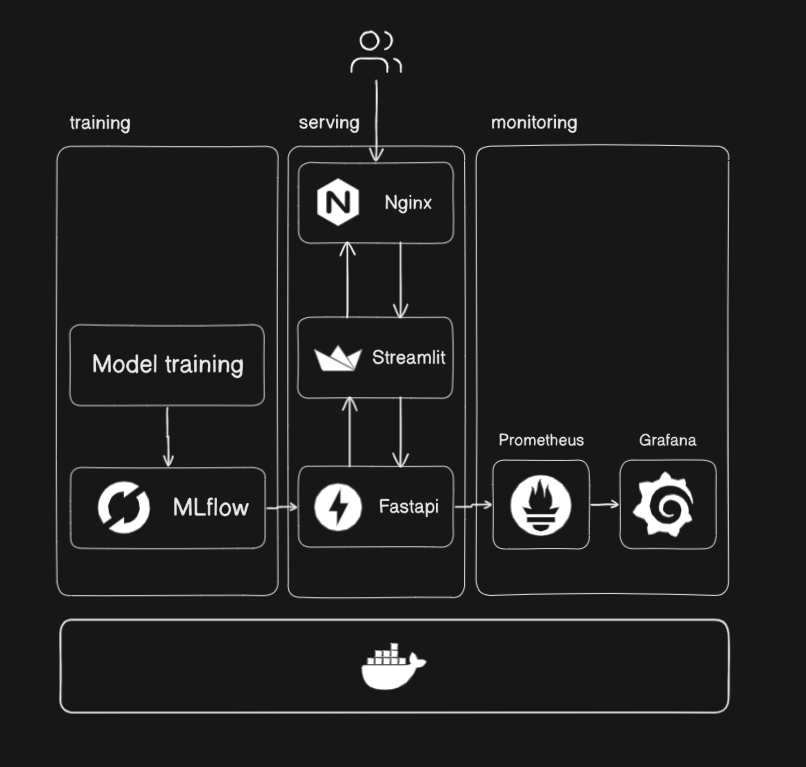

# MLOps Platform Skeleton
This repository contains a simplified MLOps platform (including training, serving and monitoring). The goal of this 
tutorial was to show what individual services do and how they work together.
Therefore, the code was kept to a minimum and everything was bundled in docker compose.
The repo can be used as a skeleton for more advanced project.
 
This project was inspired by the great [MLOps Zoomcamp](https://github.com/DataTalksClub/mlops-zoomcamp). 

## Overview

The full setup consists of three steps:
1) Training - A Dockerized job runs the Titanic survival training script with sklearn and logs metrics and artifacts (the actual models) to MLflow. 
2) Serving - The model is pulled and FastAPI delivers the prediction, a streamlit app serves as the user interface.
3) Monitoring - Metrics about the API usage/performance are pushed to Prometheus/Grafana and shown in a dashboard.

The individual services are packaged as docker containers and setup with docker compose.

## How to use
**Prerequisite**: Install Docker (Windows: Docker Desktop)

**Download repository from GitHub**

`git clone https://github.com/dpleus/mlops.git`

**Start docker compose (from project folder)**

`docker composer up`

**Access individual services**

- Reverse Proxy (Nginx) `http://localhost`
- mlflow `http://localhost:5000`
- FastAPI (to test) `http://localhost:8086/docs`
- Streamlit UI `http://localhost:8501`
- Grafana Dashboard `http://localhost:3000` Login: admin/admin

**Create example model**

Build the training image and execute it once to populate MLflow:

```
docker build -t mlops-training:latest training
docker run --rm \
	--network mlops_default \
	--env MLFLOW_TRACKING_URI=http://mlflow:5000 \
	--env MODEL_NAME=titanic-classifier \
	--volume mlops_models:/mlruns \
	mlops-training:latest
```

This registers a new model version in MLflow and promotes it to Production.

**Note**: The UI will only work if there is one "production" model in mlflow.

## Services
### 1) Docker and docker compose
`docker-compose.yaml` contains the definitions for all services. 
For every service it contains the docker image (either through `build` if based on a Dockerfile, or through `image` if a remote image). 
Also it opens the relevant ports within your "docker compose network", so that the services can communicate with each other. 
Additionally, a common volume for all containers that use mlflow is created and mounted into `/mlruns`. For Prometheus/Grafana a few configuration files are also mounted.

To initialize all services the command `docker compose up` can be used from the project folder.

### 2) Training Service
The **training script** is located at `training/model_training.py`. It loads the Titanic passenger dataset, trains a preprocessing + RandomForest pipeline, and logs metrics and the serialized model back to MLflow.

The Docker image installs the requirements and runs the script directly. Kick off ad-hoc training runs with the `docker run` command shown above, or integrate it into your CI/CD pipeline.


### 4) FastAPI
**FastAPI** is a framework for high-performance API. In this project I implemented a `/predict` endpoint. If that endpoint is queried
it will download the latest Titanic survival classifier from mlflow and output whether the passenger is predicted to survive, along with the confidence if available. Additionally, **prometheus_fastapi_instrumentator** scrapes events and sends them to Prometheus.

**Please note**: Currently the script will fetch the first model that is in production. It won't show any error if there is 
no model or there are multiple models.

### 5+6) Prometheus/Grafana
**Prometheus** open source monitoring system. **Grafana** is a dashboarding platform. In short, Prometheus receives the data, while Grafana puts a dashboard on top.
For this project, I used the provided images and just added a few configuration files:

`monitoring/prometheus.yml` - Contains configuration to connect Prometheus to FastAPI

`monitoring/datasource.yml` - Grafana: Datasource configuration

`monitoring/dashboard.json` - Grafana: Dashboard

This part was heavily inspired by https://github.com/Kludex/fastapi-prometheus-grafana
### 7) Streamlit
**Streamlit** is a Python library to rapidly build UIs. The app now collects Titanic passenger attributes (class, age, sex, family counts, fare, embarkation port) and forwards them to the API to retrieve survival predictions.

### 8) Nginx
**Nginx** acts as a lightweight reverse proxy that fronts the Streamlit UI and FastAPI service. Requests to `/` are routed to the Streamlit container, while `/api/` is forwarded to FastAPI. This provides a single entry point (`http://localhost`) for the platform.

## Limitations
**Multiple host machines**

This project is meant to be deployed on a single host machine. In practice, you might adopt an orchestrator (e.g., Kubernetes, ECS) for additional isolation and scalability.

**Storage on cloud**

All artifacts, logs, etc. are saved locally/on docker volumes. In practice, you would save them to the cloud.

**Advanced Security**

Security - of course. Authentication, SSL encryption, API authentication and what not.
Good example using nginx. [Example](https://towardsdatascience.com/deploy-mlflow-with-docker-compose-8059f16b6039
)

